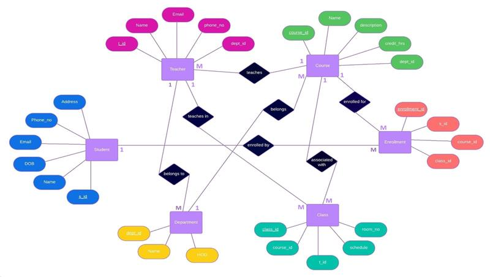

# 🎓 College Management System 

---

##  Project Overview
The **College Management System** is a database-driven academic project developed using **MySQL**.  
It manages core college entities such as **Students, Teachers, and Departments**, demonstrating practical implementation of **DBMS concepts**, **ER modeling**, and **SQL queries** using MySQL Workbench.

---

##  Key Concepts Used
- Relational Database Design  
- ER Diagram Modeling  
- Primary & Foreign Keys  
- SQL Queries & JOIN operations  

---

##  Technologies Used
- **MySQL 8.0**
- **MySQL Workbench**
- **SQL**

---

##  Database Entities
| Entity | Description |
|------|------------|
| Student | Stores student personal & academic details |
| Teacher | Stores faculty information |
| Department | Manages department data |

---

##  ER Diagram

---

##  Project Structure
College-Management-System-MySQL/
├── MySQL/
│ ├── create_tables.sql
│ ├── insert_sample_data.sql
│ └── queries.sql
│
├── screenshots/
│ ├── student_table.png
│ ├── teacher_table.png
│ ├── department_table.png
│ ├── create_tables_query.png
│ └── foreign_key_relationship.png
│
├── ER_Diagram.png
└── README.md

---  
---

##  How to Run the Project
1. Open **MySQL Workbench**
2. Connect to **Local instance MySQL80**
3. Execute `create_tables.sql` to create tables
4. Execute `insert_sample_data.sql` to insert sample records
5. Execute `queries.sql` to retrieve and verify data

---

##  Screenshots
The `screenshots` folder includes:
- Table creation queries  
- Sample data outputs  
- JOIN queries showing foreign key relationships  

---

##  Documentation
Project presentation is available in the `docs/` folder and includes:
- Problem statement  
- ER diagram  
- SQL queries  
- Query outputs  

---

##  Learning Outcomes
- Practical understanding of MySQL & SQL
- Experience in database normalization
- Hands-on ER to relational mapping
- Query execution and validation

---

##  Author
**Radhika Vyas**

---

##  Notes
This project was developed as part of an academic **DBMS coursework** and executed locally using MySQL Workbench.
